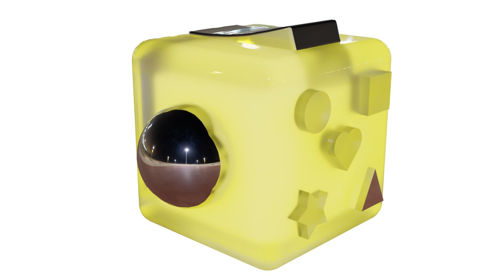
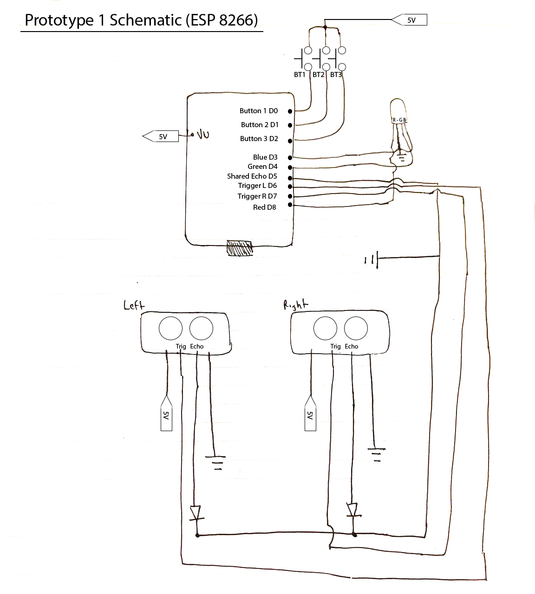

# 3.007-DTI-Cube
Tis but a cube. Two cubes to be exact.

## Prototype 1
Made from ESP8266 to test ultrasonic sensors and light. Uses 2 sensors corresponding to Hue and Brightness for HSB/HSV which is then converted to RGB to control light levels using PWM.

