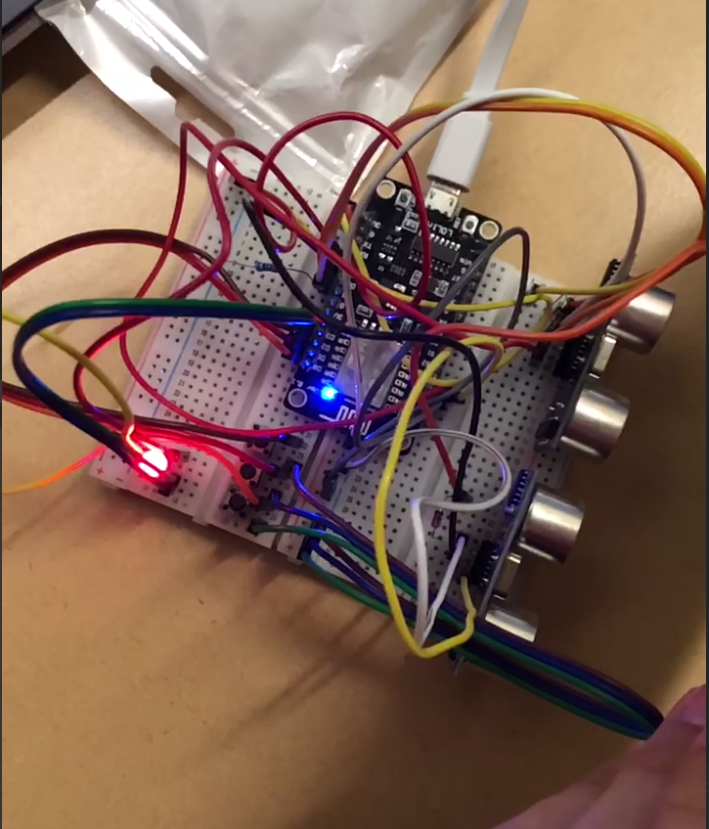

# 3.007-DTI-Cube
Tis but a cube. Two cubes to be exact.

## Prototype 1
Made from ESP8266 to test ultrasonic sensors and light. Uses 2 sensors corresponding to Hue and Brightness for HSB/HSV which is then converted to RGB to control light levels using PWM.

  
  

## Prototype 2
Ported Prototype 1 code to Prototype 2 which is instead done on an ESP32 board. The biggest advantage of this is the fact that I get to play with 36 (30 usable) GPIO pins instead of the 17 on ESP8266 (in reality the usable pins are like 10 pins only). Multiprocessing and Bluetooth is an extra plus.

## Prototype 3
Prototype 2 continued. The plan changed, there is only 1 ultrasonic sensor (for 1 slider), 3 buttons. This should be the full prototype with the WS2812B LED strip (FastLED library), ESPNow networking, speakers and SD card reader.

Update: ESPNow networking was initialized but not used in this prototype. Prototype 4 will fully implement the networking. At this stage, all other logic, including idling locally are implemented.

## Prototype 4
Basically the same goals as prototype 3 but prototype 3 was a local implementation of everything. Prototype 4 will include the final part, that is networking using ESPNow to play audio and control the other cube.

## Tasklists and features
- [x] Prototype 1 code ported to ESP32
- [x] Button handler button
- [x] WS2812B control 
- [x] Connectivity with other ESP boards using ESPNow and packet structure
- [ ] Multiprocessing 
  - [ ] Core 0 pinned to poll for incoming network packets and process them by changing cube colour
  - [ ] Core 1 pinned to interrupt on slider and button changes, and process them and send them as outgoing packets 
- [x] Speaker code
  - [-] FAT32 read from VSPI (CS pin D5)
  - [x] Send mono audio to speaker
  - [x] Reverse engineer XT_DAC_Audio library to play sound one note at a time
  - [ ] More music pieces 
- [x] WS2812B code
  - [x] Turn the LED idle state (when not much interaction) to white light
  - [ ] Set up idle flag for remote packets as well, if incoming packets update the system enough, then idle state is gone.
- [x] Schematics for final prototype
